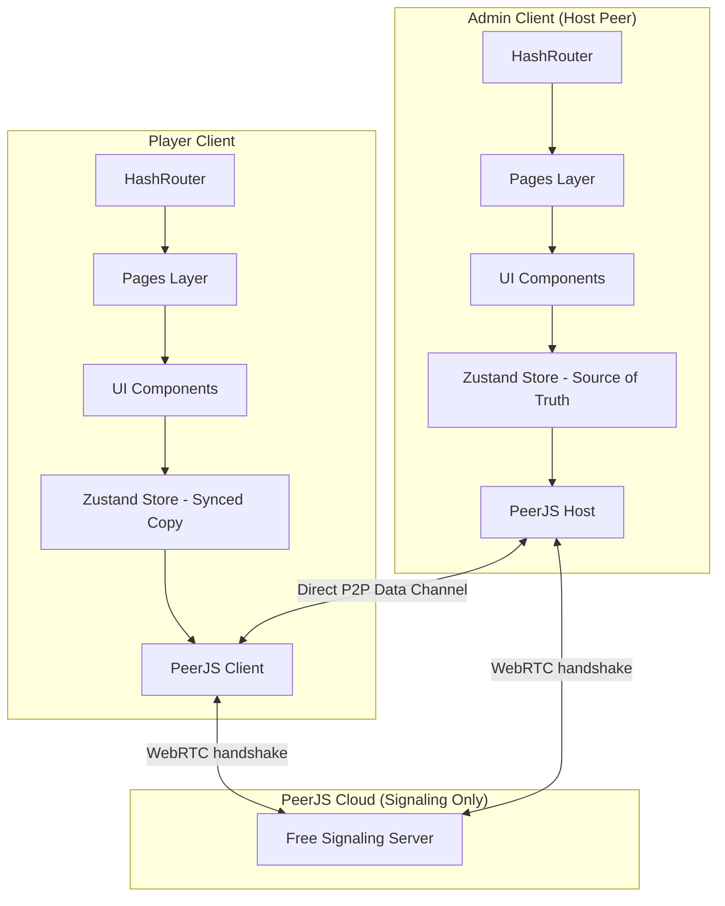
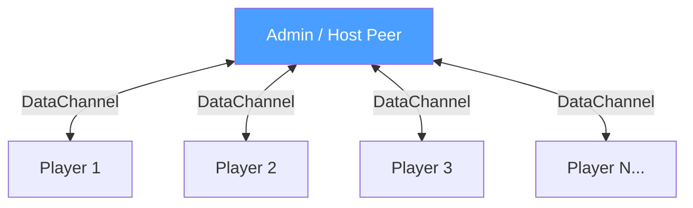
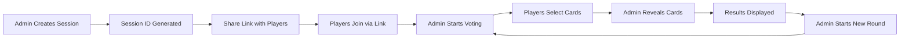
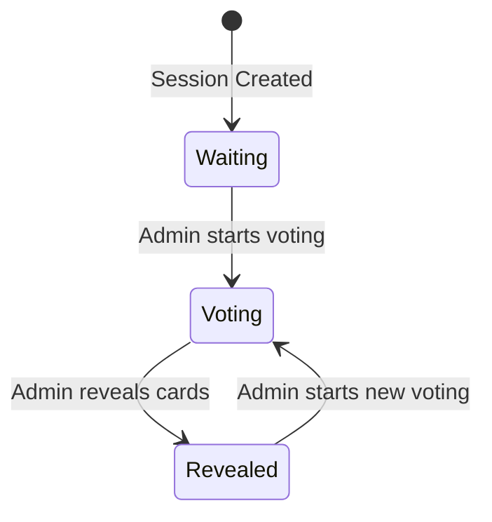
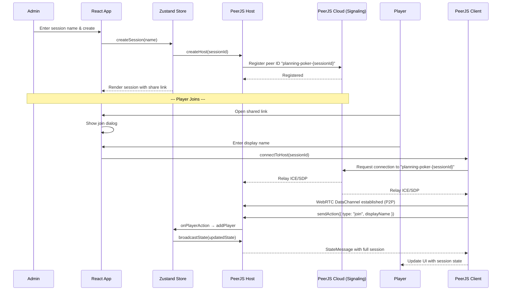
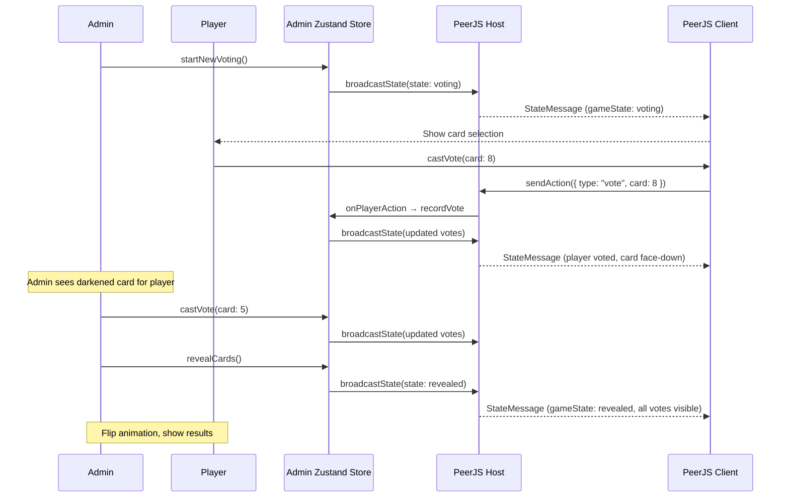
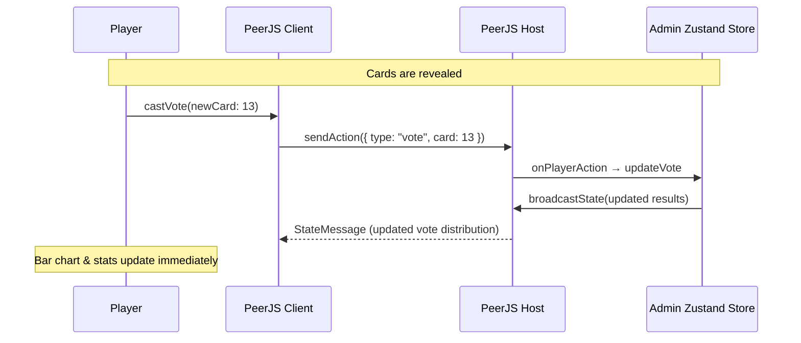

# Design Document: Planning Poker

## Overview

Planning Poker is a real-time collaborative estimation tool for Agile teams. It allows a session admin to create a voting session, share a link with team members, and facilitate rounds of Fibonacci-based story point estimation. Players join via a shared URL, select estimation cards, and the admin controls the flow — starting rounds, revealing cards, and initiating new votes.

The application is built as a client-side React SPA using Vite, with Zustand for state management. It is deployed to GitHub Pages using HashRouter for routing compatibility. The app uses a dark theme exclusively.

Since the spec targets GitHub Pages (static hosting with no backend), real-time sync between players uses **WebRTC Data Channels** via the **PeerJS** library. PeerJS provides a free cloud signaling server for the initial WebRTC handshake (ICE/SDP exchange), after which all communication flows directly peer-to-peer between browsers with no external backend required.

The admin's browser acts as the **host peer** (source of truth) in a star topology. Players connect directly to the admin via WebRTC data channels. The admin maintains authoritative session state and broadcasts updates to all connected players.

## Architecture



### Network Topology



The admin uses a **star topology** — each player connects only to the admin. Players never connect to each other. This keeps connection management simple and ensures a single source of truth.

### High-Level Data Flow



## Components and Interfaces

### Component 1: Router & Pages

**Purpose**: Handle URL-based navigation using HashRouter for GitHub Pages compatibility.

**Routes**:

```typescript
// Route definitions
const routes = [
  { path: "/", element: <CreateSessionPage /> },
  { path: "/session/:sessionId", element: <SessionPage /> },
]
```

**Pages**:

- `CreateSessionPage` — Form for admin to enter session name and create a session
- `SessionPage` — Main game view (shows join dialog if player hasn't entered a name)

---

### Component 2: Session Management

**Purpose**: Handle session creation, joining, and participant tracking.

**Interface**:

```typescript
interface SessionManager {
  createSession(sessionName: string): Session;
  joinSession(sessionId: string, displayName: string): Player;
  getSession(sessionId: string): Session | null;
  removePlayer(sessionId: string, playerId: string): void;
}
```

**Responsibilities**:

- Generate unique session IDs
- Produce shareable links containing the session ID
- Track connected players
- Assign admin role to session creator

---

### Component 3: Poker Table

**Purpose**: Visual representation of the voting table with player cards.

**Interface**:

```typescript
interface PokerTableProps {
  players: Player[];
  gameState: GameState;
  isAdmin: boolean;
  currentPlayerId: string;
  votesChanged: Set<string>; // player IDs whose vote was modified after reveal
  onRevealCards: () => void;
  onStartNewVoting: () => void;
  onEditVote: () => void; // triggered when current player clicks pencil icon
  onKickPlayer: (playerId: string) => void; // admin kicks a player
}
```

**Responsibilities**:

- Render a dynamically expanding table layout based on player count
- Display player names with face-down/face-up cards
- Darken cards of players who have voted (without revealing value)
- Show admin control button in center (Start New Voting / Reveal Cards)
- Animate card flip on reveal
- After reveal: show a pencil icon next to the player's name as an "Edit Vote" button. Clicking it re-shows the card selection panel for that player. Mouseover popover: "Edit vote"
- After reveal: if a player changed their vote (re-voted after initial reveal), show a small grey pencil icon on the bottom-right corner of their card to indicate the vote was modified. Mouseover popover: "Vote was changed"
- Admin view: show a kick (✕) icon next to each non-admin player's name. Clicking it removes the player from the session and closes their data channel. Mouseover popover: "Remove player"

---

### Component 4: Card Selection Panel

**Purpose**: Row of selectable estimation cards for players to cast votes.

**Interface**:

```typescript
interface CardSelectionProps {
  cards: CardValue[];
  selectedCard: CardValue | null;
  gameState: GameState;
  isEditing: boolean; // true when player clicked pencil icon after reveal
  voteDistribution: Map<CardValue, number> | null;
  onSelectCard: (card: CardValue) => void;
  onDeselectCard: () => void;
}
```

**Responsibilities**:

- Display Fibonacci-based card values: 0, 1, 2, 3, 5, 8, 13, 21, 34, 55, 89, ?, ☕
- Allow players to select/change their vote at any time during voting phase
- After reveal: card selection is hidden by default. It reappears only when the player clicks the pencil "Edit Vote" icon next to their name on the table.
- After reveal (when editing): hide cards with zero votes to focus on results. Full selection reappears if the player deselects their current vote.
- Highlight the currently selected card

---

### Component 5: Results Display

**Purpose**: Show vote distribution and statistics after cards are revealed.

**Interface**:

```typescript
interface ResultsDisplayProps {
  voteDistribution: Map<CardValue, number>;
  averageScore: number | null;
  agreementRatio: number;
  totalVoters: number;
}
```

**Responsibilities**:

- Render bar chart showing vote counts per card value
- Highlight the card with the highest votes
- Display average score (excluding ? and ☕)
- Show agreement ratio as a donut/circular chart

---

### Component 6: PeerJS Networking Layer

**Purpose**: Peer-to-peer real-time synchronization using WebRTC data channels via PeerJS.

**Architecture**: Star topology with admin as host peer.

**Host (Admin) Interface**:

```typescript
interface PeerHost {
  // Initialize as host with session ID as peer ID
  createHost(sessionId: string): void;
  // Broadcast full state to all connected players
  broadcastState(state: SessionState): void;
  // Handle incoming player actions
  onPlayerAction(
    callback: (playerId: string, action: PlayerAction) => void,
  ): void;
  // Handle player connection/disconnection
  onPlayerConnected(callback: (playerId: string) => void): void;
  onPlayerDisconnected(callback: (playerId: string) => void): void;
  // Kick a player: close their data channel and remove from session
  kickPlayer(playerId: string): void;
  // Cleanup
  destroy(): void;
}
```

**Client (Player) Interface**:

```typescript
interface PeerClient {
  // Connect to host using session ID as peer ID
  connectToHost(sessionId: string): void;
  // Send action to host (vote, join, etc.)
  sendAction(action: PlayerAction): void;
  // Receive state updates from host
  onStateUpdate(callback: (state: SessionState) => void): void;
  // Connection status
  onConnectionChange(callback: (connected: boolean) => void): void;
  // Handle being kicked by admin
  onKicked(callback: () => void): void;
  // Cleanup
  destroy(): void;
}
```

**Player Actions (sent from player → admin)**:

```typescript
type PlayerAction =
  | { type: "join"; displayName: string }
  | { type: "vote"; card: CardValue }
  | { type: "removeVote" };
```

**Message Protocol**:

```typescript
// Admin → Players (broadcast)
interface StateMessage {
  type: "state";
  payload: SessionState;
}

// Admin → Specific Player (kick notification)
interface KickMessage {
  type: "kicked";
}

// Player → Admin (action)
interface ActionMessage {
  type: "action";
  payload: PlayerAction;
}
```

**Connection Flow**:

1. Admin creates session → registers as PeerJS peer with ID = `planning-poker-{sessionId}`
2. Player opens link → creates PeerJS instance, connects to peer ID `planning-poker-{sessionId}`
3. PeerJS cloud server brokers the WebRTC handshake (signaling only)
4. Once DataChannel is open, all communication is direct P2P
5. Player sends `{ type: "join", displayName }` action
6. Admin adds player to state, broadcasts updated state to all players

**Responsibilities**:

- Register admin as named peer (session ID = peer ID) on PeerJS cloud
- Accept incoming player connections via WebRTC data channels
- Route player actions to the Zustand store (admin-side)
- Broadcast authoritative state from admin to all players after every state change
- Detect player disconnections and remove the player from the session (including their vote)
- Kick players on admin request: send kick message, close data channel, remove from session
- Handle reconnection attempts (rejoining players treated as new participants)

---

### Component 7: Zustand Store

**Purpose**: Central client-side state management.

**Interface**:

```typescript
interface PlanningPokerStore {
  // Session state
  session: Session | null;
  currentPlayer: Player | null;
  gameState: GameState;

  // Actions
  createSession: (name: string) => void;
  joinSession: (sessionId: string, displayName: string) => void;
  castVote: (card: CardValue) => void;
  removeVote: () => void;
  revealCards: () => void;
  startNewVoting: () => void;
  kickPlayer: (playerId: string) => void;

  // Computed
  voteDistribution: () => Map<CardValue, number>;
  averageScore: () => number | null;
  agreementRatio: () => number;
}
```

**Responsibilities**:

- Maintain local application state
- On admin: apply actions locally, then broadcast state via PeerJS host
- On players: receive state updates from admin, apply to local store
- Compute derived values (distribution, average, agreement)
- Handle optimistic updates (player-side: apply vote locally while waiting for admin broadcast)

## Data Models

### Session

```typescript
interface Session {
  id: string;
  name: string;
  adminId: string;
  players: Player[];
  currentRound: Round | null;
  createdAt: number;
}
```

**Validation Rules**:

- `id` is a unique UUID or short alphanumeric code
- `name` is a non-empty string (max 100 characters)
- `adminId` references a valid player ID
- `players` contains at least one player (the admin)

---

### Player

```typescript
interface Player {
  id: string;
  displayName: string;
  isAdmin: boolean;
}
```

**Validation Rules**:

- `id` is a unique identifier generated on join
- `displayName` is a non-empty string (max 50 characters)
- Only one player per session can have `isAdmin: true`
- Players are removed from the session entirely on disconnect (no `isConnected` tracking needed)

---

### Round

```typescript
interface Round {
  id: string;
  state: GameState;
  votes: Vote[];
  startedAt: number;
  revealedAt: number | null;
}
```

**Validation Rules**:

- `state` transitions follow: Waiting → Voting → Revealed → Waiting
- `votes` only contains one vote per player (latest vote wins)
- `revealedAt` is null until admin reveals cards

---

### Vote

```typescript
interface Vote {
  playerId: string;
  card: CardValue;
  votedAt: number;
  wasChanged: boolean; // true if player re-voted after reveal
}
```

**Validation Rules**:

- `playerId` must reference an active player in the session
- `card` must be a valid CardValue
- Players can update their vote (replaces previous entry)
- `wasChanged` is set to true when a player modifies their vote after cards have been revealed

---

### CardValue

```typescript
type NumericCard = 0 | 1 | 2 | 3 | 5 | 8 | 13 | 21 | 34 | 55 | 89;
type SpecialCard = "?" | "☕";
type CardValue = NumericCard | SpecialCard;
```

---

### GameState

```typescript
type GameState = "waiting" | "voting" | "revealed";
```

**State Transitions**:



---

### SessionState (Realtime Sync Payload)

```typescript
interface SessionState {
  session: Session;
  round: Round | null;
  votes: Vote[];
}
```

## Sequence Diagrams

### Session Creation & Joining



### Voting Flow



### Re-voting After Reveal



## Error Handling

### Error Scenario 1: Session Not Found

**Condition**: Player navigates to a session link with an invalid or expired session ID
**Response**: Display a friendly error message indicating the session doesn't exist
**Recovery**: Offer a link to create a new session

### Error Scenario 2: Player Disconnects

**Condition**: Player's WebRTC data channel disconnects (closes browser, network failure)
**Response**: Admin detects the closed data channel and removes the player from the session entirely. The player's vote is also removed. Updated state is broadcast to remaining players.
**Recovery**: The removed player can rejoin via the shared link by entering their display name again. They start fresh as a new participant.

### Error Scenario 3: Admin Kicks a Player

**Condition**: Admin clicks the kick (✕) icon next to a player's name
**Response**: Admin sends a `{ type: "kicked" }` message to the player's data channel, then closes the connection. The player is removed from the session state and their vote is discarded. Updated state is broadcast to remaining players.
**Recovery**: The kicked player sees a "You were removed from the session" message. They can rejoin via the shared link if the admin allows it (no block list).

### Error Scenario 4: Duplicate Display Name

**Condition**: Player tries to join with a name already in use in the session
**Response**: Admin rejects the join action and sends an error message back via the data channel
**Recovery**: Player sees validation error on the join form, prompted to choose a different name

### Error Scenario 5: Admin Disconnects

**Condition**: The admin closes the browser or loses connection
**Response**: All player data channels close. Players see a "Host disconnected" message.
**Recovery**: Since the admin IS the session (source of truth), the session effectively ends. Players are shown a message explaining the host left. If the admin reopens the link, they can create a fresh session. (Session state is ephemeral by design — planning poker sessions are short-lived.)

### Error Scenario 6: PeerJS Signaling Server Unavailable

**Condition**: PeerJS cloud signaling server is down or unreachable
**Response**: Display error message that the connection service is temporarily unavailable
**Recovery**: Retry connection after a delay. Optionally, allow configuring a self-hosted PeerJS server as fallback.

## Testing Strategy

### Unit Testing Approach

- Test Zustand store actions and computed values in isolation
- Test card value calculations (average excluding ?, ☕; agreement ratio)
- Test game state transitions (waiting → voting → revealed)
- Test vote distribution computation
- Test PeerJS message serialization/deserialization
- Use Vitest as the test runner (aligned with Vite ecosystem)

### Property-Based Testing Approach

**Property Test Library**: fast-check

- Property: Average calculation always excludes ? and ☕ cards
- Property: Agreement ratio is always between 0 and 1
- Property: Vote distribution sum equals total number of voters
- Property: Game state transitions are valid (no skipping states)
- Property: Only one vote per player exists at any time

### Integration Testing Approach

- Test full session lifecycle: create → join → vote → reveal → new round
- Test realtime sync between multiple simulated clients
- Test card selection visibility rules after reveal
- Use React Testing Library for component integration tests

## Performance Considerations

- **Optimistic Updates**: Apply vote changes locally before admin broadcast to minimize perceived latency
- **Minimal Payloads**: Admin broadcasts full state (small for planning poker — ~1-2KB max) on every change for simplicity and consistency
- **Efficient Re-renders**: Use Zustand selectors to prevent unnecessary component re-renders
- **Animation Performance**: Use CSS transforms for card flip animations (GPU-accelerated)
- **Player Limit**: Design supports up to ~20 players per session (typical Agile team size); star topology handles this easily
- **WebRTC Efficiency**: Data channels have near-zero latency once established; no server round-trip for messages

## Security Considerations

- **Session IDs**: Use sufficiently random IDs (nanoid) to prevent guessing peer IDs
- **Admin as Host**: Admin role is inherent — whoever creates the PeerJS host IS the admin. No token spoofing possible since admin actions execute locally on the host.
- **Input Sanitization**: Sanitize display names and session names to prevent XSS
- **No Sensitive Data**: Application handles only display names and card values — no authentication or personal data required
- **Data Channel Security**: WebRTC data channels are encrypted (DTLS) by default — messages between peers cannot be intercepted
- **Message Validation**: Admin validates all incoming player actions (reject malformed messages, invalid card values, etc.)

## Dependencies

| Dependency             | Purpose                                                 |
| ---------------------- | ------------------------------------------------------- |
| React 18+              | UI framework                                            |
| Vite                   | Build tool and dev server                               |
| Zustand                | Client-side state management                            |
| react-router-dom       | Routing (HashRouter)                                    |
| peerjs                 | WebRTC abstraction (P2P data channels + free signaling) |
| nanoid                 | Short unique ID generation                              |
| fast-check             | Property-based testing                                  |
| vitest                 | Test runner                                             |
| @testing-library/react | Component testing                                       |
| framer-motion or CSS   | Card flip animations                                    |
| framer-motion or CSS   | Card flip animations                                    |

## Correctness Properties

_A property is a characteristic or behavior that should hold true across all valid executions of a system — essentially, a formal statement about what the system should do. Properties serve as the bridge between human-readable specifications and machine-verifiable correctness guarantees._

### Property 1: Input validation accepts only valid names

_For any_ string, the session name validator should accept it if and only if it is non-empty and at most 100 characters, and the display name validator should accept it if and only if it is non-empty and at most 50 characters.

**Validates: Requirements 1.3, 2.3**

### Property 2: Game state transitions follow valid sequence

_For any_ sequence of admin actions (start voting, reveal cards, start new voting), the game state should only transition along the valid path: waiting → voting → revealed → voting. Invalid transitions (e.g., revealing from "waiting", or starting voting from "voting") should be rejected.

**Validates: Requirements 3.1, 3.2, 3.3**

### Property 3: At most one vote per player per round

_For any_ sequence of vote actions by any number of players within a single round, each player should have exactly zero or one vote recorded in the round state. A new vote from the same player replaces the previous one.

**Validates: Requirements 4.3, 4.4**

### Property 4: New round clears all previous votes

_For any_ session in "revealed" state with existing votes, starting a new voting round should result in zero votes and all `wasChanged` flags reset to false.

**Validates: Requirements 3.5**

### Property 5: Card value validation rejects invalid values

_For any_ arbitrary value received as a vote, the host should accept it if and only if it is a member of the valid CardValue set (0, 1, 2, 3, 5, 8, 13, 21, 34, 55, 89, "?", "☕").

**Validates: Requirements 4.7, 10.4**

### Property 6: Average score excludes non-numeric cards

_For any_ set of votes containing a mix of numeric cards and special cards (? and ☕), the computed average should equal the arithmetic mean of only the numeric card values, completely excluding ? and ☕ votes from the calculation.

**Validates: Requirements 7.3**

### Property 7: Agreement ratio computation

_For any_ non-empty set of votes, the agreement ratio should equal the count of voters who selected the most common card value divided by the total number of voters, and the result should always be between 0 and 1 (inclusive).

**Validates: Requirements 7.5**

### Property 8: Vote distribution sum equals total voters

_For any_ set of votes in a round, the sum of all values in the vote distribution map should equal the total number of players who have voted.

**Validates: Requirements 7.1, 7.5**

### Property 9: Duplicate display name rejection

_For any_ session with existing players, attempting to join with a display name that matches (case-insensitive) any existing player's display name should be rejected.

**Validates: Requirements 2.5**

### Property 10: Player IDs are unique

_For any_ sequence of players joining a session, all assigned player IDs should be distinct from each other.

**Validates: Requirements 2.6**

### Property 11: Post-reveal vote change sets wasChanged flag

_For any_ player who modifies their vote after the game state has transitioned to "revealed", the resulting vote record should have `wasChanged` set to true.

**Validates: Requirements 5.5**

### Property 12: Zero-vote cards hidden during post-reveal editing

_For any_ vote distribution in the "revealed" state, when a player is editing their vote, the card selection panel should display only cards that received at least one vote (plus the full set if the player deselects their current vote).

**Validates: Requirements 5.3, 5.4**

### Property 13: Message structure validation

_For any_ arbitrary JSON message received by the host peer, the host should accept it only if it conforms to the valid PlayerAction schema (join, vote, or removeVote with correct fields).

**Validates: Requirements 10.3**

### Property 14: Player removal on disconnect cleans up vote

_For any_ player who disconnects from the session, the resulting session state should not contain that player in the players list, and the round's votes array should not contain any vote with that player's ID.

**Validates: Requirements 9.1, 9.2**

### Property 15: State replacement on authoritative update

_For any_ valid SessionState received from the host peer, the player's local store should reflect that exact state after applying the update (authoritative state fully replaces local state).

**Validates: Requirements 8.2**

### Property 16: XSS sanitization

_For any_ string containing HTML tags or script elements, the sanitized output should not contain executable markup or script content.

**Validates: Requirements 10.2**

### Property 17: Session creator is always admin

_For any_ newly created session, the session should contain exactly one player with `isAdmin: true`, and that player should be the session creator.

**Validates: Requirements 1.5**
